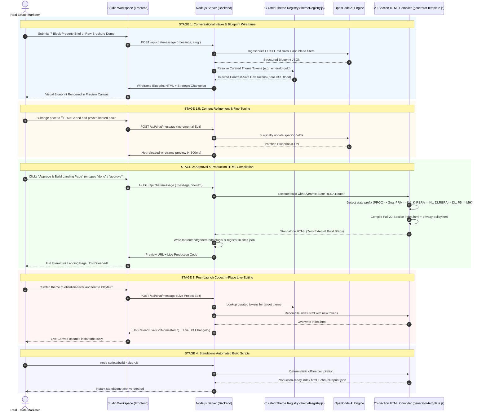
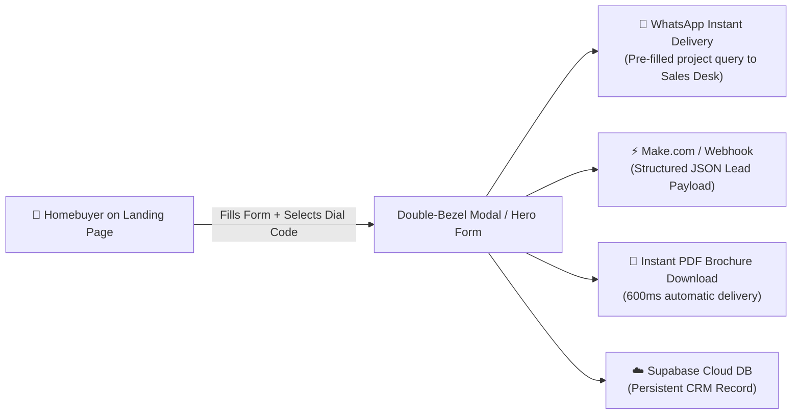
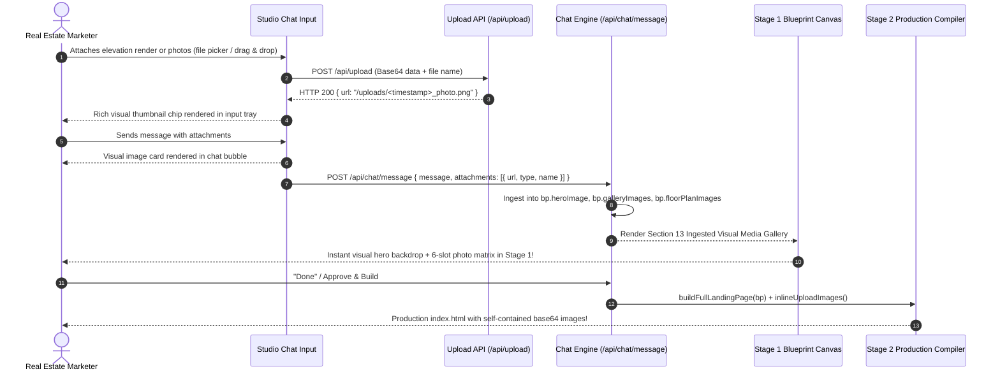

# Platform Workflows & Operational Lifecycle

The **Justflip PropTech Studio** operates under a structured, deterministic lifecycle designed for high-conversion real estate landing page generation, multi-state statutory compliance, curated design governance, and real-time live editing. This document details the exact operational mechanics of each workflow.

---

## 1. High-Level Operational Lifecycle



---

## 2. Stage 1: Conversational Property Intake (Blueprint Mode)

### Step 1: Input Structured Property Notes
Users paste property details into the chat prompt box. To achieve benchmark accuracy and zero missing fields, prompts should follow the **7-Block Gold Standard Structure**:

```text
Generate a high-converting, ultra-luxury residential landing page for "[Project Name]" in [Location] under /landing-page-agent specifications.

1. Project Specs:
- Project Name: [Project Name]
- Developer: [Developer / Promoter Entity]
- Micro-Market: [Specific Sub-market, Landmark, Pincode]
- State RERA Registration: [e.g. PRGO07190696 | PRM/KA/RERA/... | DLRERA...]
- Land Parcel & Scale: [Acres | Number of Towers/Villas | Open Space %]
- Architectural Style: [Vernacular, Contemporary, High-Rise, Biophilic]
- Direct Sales Helpline: [+91 XXXXX XXXXX] | WhatsApp: [+91 XXXXX XXXXX]

2. Pricing & Typologies:
- [Typology 1]: [Area] | [Price] | [Key Features]
- [Typology 2]: [Area] | [Price] | [Key Features]
- [Typology 3]: [Area] | [Price] | [Key Features]
- Payment Plan / Yield: [Milestone Plan or % Rental Leaseback]

3. 8-Card Scale & Master Metrics:
- Total Land Area: [X.XX Acres]
- Elevation / Towers: [G+X Floors / X Towers]
- Total Residences: [Unit Count]
- Configurations: [Typologies Range]
- Open Space: [XX% Biophilic Greens]
- Clubhouse / Amenities Hub: [Size or Description]
- Status: [Under Construction / New Launch / Ready to Move]
- Developer Rating: [CRISIL Rating / Years Legacy / Corporate Backing]

4. Master Amenities & Lifestyle:
- [Amenity 1 - Private / Wellness]
- [Amenity 2 - Sports / Clubhouse]
- [Amenity 3 - Infrastructure / EV / Power Backup]
- [Amenity 4 - Concierge / Hospitality / Security]

5. Commute & Micro-Market Connectivity:
- Category 1: Transit & Arteries ([Distance & Time])
- Category 2: Business & Commercial ([Distance & Time])
- Category 3: Social Infrastructure, Schools & Beaches ([Distance & Time])

6. Editorial Story:
- Paragraph 1: [Architectural vision, scale & positioning]
- Paragraph 2: [Materials, craft, biophilic landscaping]
- Paragraph 3: [Statutory security, escrow governance & investment thesis]

7. Theme & Color Tokens:
- Selected Curated Theme: [emerald-gold | obsidian-silver | coastal-azure | navy-gold | royal-silver | terracotta-warm]
```

---

### Step 2: Semantic Synthesis & Parser Extraction (Anti-Bleed Safeguard)
The backend (`backend/server.js`) ingests the message and routes it to the AI engine or deterministic regex extraction pipeline:
- **Project Name & Title Extraction:** Cleaned with strict line boundary delimiters (`split(/\r?\n/)[0]`) so downstream bullet points (like `\n- Developer: ...`) are never accidentally swallowed into the project title.
- **Slug Sanitization:** Converts the brand into a URL-safe directory identifier (e.g., `isprava-estate-fonteira`, `land-trades-shivabagh`).
- **Project Isolation:** Detecting a new project brief automatically spawns a distinct slug directory under `frontend/generated/<slug>/`, preventing active workspace pollution.

---

### Step 3: Curated Theme Tokens (`themeRegistry.js`) vs Generative Color Hallucinations
To eliminate unreadable, oversaturated AI-generated hex palettes and massive CSS injection leaks, all color token assignment is governed by **`themeRegistry.js`**:

```javascript
// backend/themeRegistry.js & frontend/utils/themeRegistry.js
const themeRegistry = {
  'emerald-gold': {
    name: 'Biophilic/Luxury',
    primary: '#0F291E',
    secondary: '#1A3B2E',
    accent: '#D4AF37',
    bg: '#0A140F',
    text: '#F3F4F6',
    surface: '#132A20'
  },
  'obsidian-silver': {
    name: 'Modern Tech/High-Rise',
    primary: '#0F172A',
    secondary: '#1E293B',
    accent: '#94A3B8',
    bg: '#020617',
    text: '#F8FAFC',
    surface: '#0F172A'
  },
  'coastal-azure': {
    name: 'Waterfront/Resort',
    primary: '#082F49',
    secondary: '#0C4A6E',
    accent: '#38BDF8',
    bg: '#F0F9FF',
    text: '#0F172A',
    surface: '#E0F2FE'
  }
};
```

1. When a user requests a theme (e.g. `selectedThemeKey: 'emerald-gold'`), the server looks up the exact calibrated token values.
2. The AI prompt instructs OpenCode to return the token key rather than inventing 6 arbitrary hex values.
3. Contrast is mathematically guaranteed to meet WCAG AA standards (4.5:1 ratio minimum).

---

### Step 4: Named W3C Colors to Hex Resolution Protocol
If a user specifies standard English named colors in chat (e.g., *"Make it AliceBlue with DarkGoldenRod accents"*), the system deterministically translates names into valid 6-character hex codes before passing them to the compiler:
- `AliceBlue` &rarr; `#F0F8FF`
- `MidnightBlue` &rarr; `#191970`
- `DarkGoldenRod` &rarr; `#B8860B`
- `AntiqueWhite` &rarr; `#FAEBD7`
- `ForestGreen` &rarr; `#228B22`

Bare color name strings are never allowed to bleed into production CSS properties.

---

### Step 5: Wireframe Blueprint Presentation
The Studio renders an instant visual blueprint (`Stage 1`) in the right-hand canvas:
- Marketers review copy hierarchy, pricing cards, 8-card scale stats, and connectivity tables without compiling production HTML.
- Fast iteration: Content tweaks take `< 300ms`.

---

## 3. Stage 2: Production Compilation & Dynamic Multi-State RERA Routing

When the user types **"done"**, **"approve"**, or clicks the prominent green **[Approve & Build Landing Page]** button:

```
  User Approval Gate -> Execute Compilation -> Dynamic RERA Routing -> Write Single-File index.html
```

### Step 1: Two-Phase Approval Gate Trigger
The backend receives `/api/chat/build` or `/api/chat/message` with approval intent:
1. Locks the active blueprint state.
2. Changes project status from `'blueprint'` to `'built'`.

---

### Step 2: Dynamic Multi-State RERA Verification & Routing Engine
`backend/generator-template.js` automatically inspects the project's RERA ID and location string to resolve the statutory state regulatory body, label, and verification portal URL:

| State / Micro-Market | RERA ID Pattern / Keyword Match | Dynamic Label | Official Portal URL |
| :--- | :--- | :--- | :--- |
| **Goa** | `/PRGO\|goa/i` | `Goa RERA No.` | `https://rera.goa.gov.in/` |
| **Karnataka** | `/PRM\|karnataka/i` | `Karnataka RERA No.` | `https://rera.karnataka.gov.in/` |
| **Kerala** | `/K-RERA\|kerala\|kochi\|ernakulam/i` | `K-RERA No.` | `https://rera.kerala.gov.in/` |
| **Delhi NCR** | `/DLRERA\|delhi\|moti nagar/i` | `Delhi RERA No.` | `https://rera.delhi.gov.in/` |
| **Maharashtra** | `/P5\d+\|maharera\|mumbai/i` | `MahaRERA No.` | `https://maharera.mahaonline.gov.in/` |
| *Fallback* | Unmatched | `RERA No.` | `https://rera.karnataka.gov.in/` |

**Where Dynamic Routing Is Injected:**
1. **Section 1 Top Statutory Header:** Clickable badge directing buyers to verify the project on the state's official portal.
2. **Section 4 Summary Table:** Table row labeled dynamically (`Goa RERA No.`, `Delhi RERA No.`, etc.).
3. **Section 19 Legal Disclaimer & Escrow Governance:** Official state legal disclosure anchoring promoter entities and escrow safeguards.

---

### Step 3: Complete 20-Section Architecture
The compiler synthesizes a self-contained, single-file `index.html` encompassing all 20 conversion-optimized sections:
1. **Section 1:** Sticky Glass Pill Navbar (Logo, Navigation, Call & WhatsApp CTAs)
2. **Section 2:** Hero Immersion & 15-Dial-Code Double-Bezel Lead Form
3. **Section 3:** 8-Card Master Scale & Metrics Grid
4. **Section 4:** Project Snapshot & Statutory Summary Table
5. **Section 5:** Typology Showcase & Real-Time Price Matrix
6. **Section 6:** Interactive Tabbed Floor Plans with Dimension Specs
7. **Section 7:** Master Plan & Architectural Layout Blueprint
8. **Section 8:** Signature Lifestyle Amenities (Segmented by Wellness, Sports & Leisure)
9. **Section 9:** Micro-Market Location & Commute Radius Matrix
10. **Section 10:** Editorial Narrative & Architectural Craftsmanship
11. **Section 11:** Construction Milestone Tracker & Live Progress
12. **Section 12:** Banking & Approved Home Loan Partners Strip
13. **Section 13:** About the Developer (Legacy, Deliveries & CRISIL Rating)
14. **Section 14:** Interactive Investment Calculator / Rental Yield Forecaster
15. **Section 15:** High-Value Downloadable Assets (Brochure, Cost Sheet, Sanctions)
16. **Section 16:** Frequently Asked Questions (FAQ Accordion with Schema.org)
17. **Section 17:** Customer Testimonials & Investor Endorsements
18. **Section 18:** Schedule Guided Private Site Visit Form
19. **Section 19:** Comprehensive Statutory RERA & Escrow Disclaimers
20. **Section 20:** Sticky Mobile Floating Lead Bar (`Call Now` | `WhatsApp` | `Instant Cost Sheet`)

---

### Step 4: Asset Scaffolding & Site Registry Integration
1. Compiles and saves `index.html` to `frontend/generated/<slug>/index.html`.
2. Generates companion `privacy-policy.html` in the same directory.
3. Saves immutable `chat-blueprint.json` snapshot for deterministic reproduction.
4. Registers project in `backend/data/sites.json` with clean project and developer names.
5. Emits hot-reload signal with cache-busting timestamp to the Studio workspace.

---

## 4. Stage 3: Post-Launch Codex In-Place Live Editing

Once a project has status `'built'`, users can converse naturally to modify any section in real time:

### Supported Conversational Commands:
- **Price Changes:** *"Update starting price to ₹18.75 Cr and adjust 4 BHK cost sheet."*
- **Theme Swapping:** *"Switch to coastal-azure theme"* or *"Use obsidian-silver."*
- **Font Switching:** *"Change typography to Playfair Montserrat"* or *"Switch to Poppins."*
- **Amenity Additions:** *"Add private heated lap pool and 24/7 butler service."*
- **Commute Updates:** *"Set Mopa Airport distance to 35 mins / 28 km."*

### Execution Mechanics:
1. `backend/server.js` parses the incoming patch request against existing `chat-blueprint.json`.
2. Updates only the specified fields, leaving all other data blocks untouched.
3. Automatically recompiles `index.html`.
4. Client iframe reloads with `?t=<timestamp>`, rendering updates in `< 300ms`.

---

## 5. Stage 4: Standalone Automated Build Scripts (`scripts/build-<slug>.js`)

For automated CI/CD pipelines, offline compilation, and repository archiving, every flagship project is paired with a standalone Node.js compilation script in `scripts/`:

```bash
# Recompile any flagship project deterministically from terminal:
node scripts/build-isprava-estate-fonteira.js
node scripts/build-land-trades-shivabagh.js
node scripts/build-dlf-one-midtown.js
node scripts/build-marina-one.js
```

### Script Architecture:
```javascript
const fs = require('fs');
const path = require('path');
const generatorTemplate = require('../backend/generator-template');
const { getThemePalette } = require('../backend/themeRegistry');

const slug = 'isprava-estate-fonteira';
const selectedThemeKey = 'emerald-gold';
const curPalette = getThemePalette(selectedThemeKey);

const blueprint = {
  slug,
  projectName: 'Isprava Estate Fonteira',
  developerName: 'Isprava Vaddo Hospitality & Developments',
  location: 'Badem - Bouta Waddo, Assagao, North Goa 403507',
  reraId: 'PRGO07190696',
  selectedThemeKey,
  theme: {
    primaryColor: curPalette.primary,
    secondaryColor: curPalette.secondary,
    accentColor: curPalette.accent,
    backgroundColor: curPalette.bg,
    textColor: curPalette.text,
    surfaceColor: curPalette.surface
  },
  // ... complete 20-section dataset ...
};

const html = generatorTemplate.render(blueprint);
fs.writeFileSync(path.join(outputDir, 'index.html'), html, 'utf8');
```

---

## 6. Stage 5: Lead Capture & Multi-Channel CRM Dispatch



1. **15-Country Dialing Code Capture:**
   Phone input includes pre-calibrated international country codes (`IN +91`, `AE +971`, `US +1`, `UK +44`, `SG +65`, `SA +966`, `QA +974`, `CA +1`, `AU +61`, etc.) with strict numeric validation.
2. **Instant Gratification Hook:**
   Submitting inquiry triggers an automated client-side PDF brochure download within 600ms.
3. **Multi-Channel Dispatch:**
   - **WhatsApp:** Direct deep link opening WhatsApp with formatted buyer requirements.
   - **Webhooks:** Instant JSON payload sent to Make.com, HubSpot, or Salesforce.
   - **Supabase DB:** Direct SQL insertion into project leads table.

---

## 7. Production Verification & Quality Checklist

Before shipping or signing off on any generated landing page, verify the following:

- [ ] **HTTP 200 OK:** Verify page resolves cleanly (`curl -I http://127.0.0.1:3000/generated/<slug>/index.html`).
- [ ] **State RERA Label & Portal URL:** Confirm Section 1, Section 4, and Section 19 reflect the correct state portal (e.g. `rera.goa.gov.in` for Goa, `rera.delhi.gov.in` for Delhi).
- [ ] **Color Contrast:** Verify curated theme tokens are active without bare color names or fluorescent AI hex values.
- [ ] **Visual Media & Photos:** Ensure uploaded hero elevation, gallery photos, and floor plans render in both Stage 1 Blueprint Wireframe and Stage 2 Production HTML.
- [ ] **Mobile Responsiveness:** Ensure the sticky bottom lead bar (`Call Now` | `WhatsApp` | `Enquire`) appears on viewports `< 768px`.
- [ ] **Zero Asset Bleed:** Verify developer name, project title, and micro-market are completely isolated with no placeholder text.
- [ ] **Standalone Integrity:** Open the file directly via `file:///` in any browser to verify zero build tool dependencies.

---

## 8. Image & Media Ingestion and End-to-End Preview Architecture



### 1. Client-Side Image Previews
- **Input Bar Tray (`#ai-chat-attachments`):** When files are picked or dragged into `#ai-chat-input`, they are compressed via non-blocking canvas compression (`compressImageForWeb`), uploaded to `/api/upload`, and immediately rendered as visual image thumbnail cards with an `Image Ready` status badge and a remove button.
- **Chat History Message Bubbles (`addAiChatMessage`):** User message bubbles render attached images as rich visual preview cards (`` thumbnail + monospace filename + `Attached Image` badge) instead of plain text badges.
- **Session & Reload Memory:** Attached media objects `{ name, type, url }` are stored in `chat-history.json` and automatically re-rendered with full thumbnails when reloading or switching projects.

### 2. Backend Asset Ingestion
- Uploaded files are persisted in `frontend/uploads/<timestamp>_<filename>`.
- In `POST /api/chat/message`, image attachments are identified and ingested into the project blueprint:
  - `bp.heroImage`: The first uploaded elevation asset is assigned as the master hero banner backdrop.
  - `bp.galleryImages`: Attached images are prepended to the 6-slot lifestyle gallery matrix.
  - `bp.floorPlanImages`: Floor plan and layout files are routed to the interactive floor plan tabbed viewer.
  - **Memory Persistence:** Image assignments are written to `chat-blueprint.json` and preserved across subsequent OpenCode refinement turns.

### 3. Stage 1 Wireframe Visual Media Preview
- `renderBlueprintHtml(bp)` features a dedicated **Section 13: Project Visual Media & Ingested Assets** card.
- Displays a high-resolution Hero Elevation Banner preview and a 6-slot responsive Gallery Matrix.
- Each slot clearly displays whether it is an `Active Custom Upload` or `Curated Architectural Stock`, allowing immediate visual verification before compiling production code.

### 4. Stage 2 Production Base64 Inlining
- During production generation (`generatorTemplate.buildFullLandingPage(bp)`), `inlineUploadImages()` automatically converts all local `/uploads/...` paths into self-contained base64 data URIs.
- This ensures the output `index.html` is completely standalone and functional without external server hosting dependencies.

---

## 9. Modular Dynamic Image Props & CMS Studio Architecture

The landing page generator and Studio CMS implement a fully modular, prop-driven image architecture designed to function as an intuitive headless CMS for real estate marketing teams while strictly preserving the underlying OpenCode state management, routing, and compilation protocols.

```mermaid
flowchart TD
    subgraph CMS_Studio [Frontend Studio - Section E: Asset Vault]
        U1[Overview Reel Inputs] --> P[collectIntakePayload]
        U2[Brochure 3D Stack: 3 Slots] --> P
        U3[Connectivity Map Slot] --> P
        U4[Green Statement Banner Slot] --> P
        U5[Life At Experience Array] --> P
        U6[Fixed 6-Slot Gallery Matrix] --> P
        U7[Virtual Tour Poster Slot] --> P
    end

    subgraph State_Engine [OpenCode Engine & Persistence Layer]
        P --> API[/api/chat/build & /api/chat/message]
        API --> BP[(chat-blueprint.json)]
        BP --> Merger[getOrInitBlueprint & Props Normalizer]
    end

    subgraph Production_Compiler [Dual Compilers: backend/generator-template.js & Studio buildFullLandingPage]
        Merger --> S1[1. Overview Carousel Slider]
        Merger --> S2[2. 3D Brochure Stack z-index 1,2,3]
        Merger --> S3[3. Dynamic Location Map]
        Merger --> S4[4. Three-Quarters Green Banner]
        Merger --> S5[5. Life At Responsive Grid .map]
        Merger --> S6[6. Gallery Fixed 6 Slots]
        Merger --> S7[7. Virtual Tour Poster Stage]
    end

    Production_Compiler --> HTML[(Standalone index.html)]
```

### The 7 Technical Specifications

1. **Project Overview Component (The Carousel):**
   - **State Variables:** `window.activeOverviewIndex = 0`, cycling across `window.overviewReel = [...]`.
   - **Controls:** Functional left (`navigateOverviewSlider(-1)`) and right (`navigateOverviewSlider(1)`) navigation buttons with SVG chevron icons and smooth array cycling.
   - **Indicator Dots:** Dynamic progress dots reflecting the active slide.
   - **Props:** `overviewImages: string[]` or `overviewImage: string`.

2. **Brochure Section (Z-Index Magic):**
   - **3D Stacked Layout:** 3 images configured with CSS absolute positioning and layered depth:
     - **Card 1 (Top Layer):** `z-index: 3`, `.bro-card-front-1` displaying `brochureImage1`.
     - **Card 2 (Middle Layer):** `z-index: 2`, `.bro-card-front-2` displaying `brochureImage2`.
     - **Card 3 (Behind Layer):** `z-index: 1`, `.bro-card-behind` displaying `brochureImage3`.
   - **Props:** `brochureImage1`, `brochureImage2`, `brochureImage3`.

3. **Location Map (Dynamic Render):**
   - Dynamic component taking `locationMapImage` prop with dedicated upload, preview, and URL binding in Section E of the studio.
   - Renders inside `.loc-map` with responsive zoom and micro-market connectivity highlights.
   - **Prop:** `locationMapImage: string`.

4. **"Three-Quarters Green" Section (Inline Styles):**
   - Directly binds CSS `background-image: url('${greenBannerImage}')` to section container and background layers.
   - Accommodates high-resolution landscape and biophilic park visuals without CSS stylesheet tampering.
   - **Props:** `greenBannerImage: string` (aliased to `statementBannerImage`).

5. **Life At Parklane (Dynamic Grid Mapping):**
   - Flexible component accepting an array of lifestyle objects (`lifeAtImages`) and rendering via dynamic `.map()`.
   - Generates `.life-at-grid` with auto-fit CSS grid columns (`repeat(auto-fit, minmax(240px, 1fr))`), image zoom on hover (`scale(1.06)`), title tags, category tags, and descriptive captions.
   - **Props:** `lifeAtImages: Array<{ src/img, title, desc/caption }>` with robust default fallbacks.

6. **Gallery Section (Fixed Grid Slots):**
   - CSS Grid with exactly 6 assigned slots (`gal1` through `gal6`), mapped with `data-slot="gal1"` through `data-slot="gal6"`.
   - In Section E (Asset Vault), dedicated inputs and instant upload triggers exist for all 6 individual slots.
   - **Props:** `gal1`, `gal2`, `gal3`, `gal4`, `gal5`, `gal6`.

7. **Virtual Tour (Custom Background Wrapper):**
   - Customizable background wrapper via `tourBackgroundImage` with inline `style="background-image: url('${tourBackgroundImage}'); ..."`.
   - Structured with isolated layering (`tour-stage`, `tour-veil`, `tour-host`, `tour-shield`, `tour-play`) to ensure the background poster never obstructs YouTube/Vimeo embed playback or modal controls.
   - **Prop:** `tourBackgroundImage: string`.
8. **Admin Floating CMS Control Box (Live Hot-Swap & Post-Deployment Management):**
   - **Floating Trigger Button (`#cmsTriggerBtn`):** Fixed bottom-right glowing trigger (`⚡ Image CMS`) positioned at `z-index: 9998` with pulsing status indicator. Opens the side-panel drawer on click without navigating away or disturbing user scroll state.
   - **Side-Panel Drawer (`#cmsDrawer` & `#cmsVeil`):** Smooth right-sliding glassmorphism drawer (`z-index: 9999`) containing separate, individual input fields, preview thumbnails, and file upload zones for every image area on the site:
     - *Hero Elevation Banner:* Slot `#hero-img-node` (`heroImage`).
     - *Overview Carousel Slides:* Slots `overviewSlide0` through `overviewSlide3` with real-time sync into `window.overviewReel` and active slider DOM.
     - *3D Stacked Brochure Cards:* Card 1 (Cover, `z-index: 3`, `#bro-img-1`), Card 2 (Spread, `z-index: 2`, `#bro-img-2`), Card 3 (Behind Card, `z-index: 1`, `#bro-img-3`), and Background Blur (`#bro-bg-img`).
     - *Location Connectivity Map:* Slot `#loc-map-img` (`locationMapImage`).
     - *Statement & Video Backgrounds:* "Three-Quarters Green" Banner (`#greenBandSec`, `#greenBandBg`) and Virtual Tour Poster (`#tourStage`, `#tourPosterImg`).
     - *Fixed 6-Slot Gallery Matrix:* Dedicated slots `gal1` through `gal6` mapped to `data-slot="gal1..6"` and `#gal-img-1..6`.
     - *Master Plan Blueprint:* Slot `#masterPlanImg` (`masterPlanImage`).
   - **Post-Deployment Hot-Swapping (`window.CmsController`):**
     - Works dynamically **after the landing page is built and deployed** in live production environments without touching source code.
     - **Zero-Latency Upload Hot-Swap:** File uploads use HTML5 `FileReader.readAsDataURL` to instantly paint local base64 data URLs to the live DOM in 0ms, followed by background asynchronous sync to `/api/upload` when hosted online.
     - **Persistence Tier:** 
       1. Browser `localStorage` (`justflip_cms_<slug>`) ensures all changes persist across page reloads and browser sessions even on static CDNs or `file:///` previews.
       2. **Save to Server:** Invokes `POST /api/chat/save-images` to merge changes directly into `chat-blueprint.json` and recompile `index.html`.
       3. **Export JSON:** One-click download of the complete image manifest (`cms-images-<slug>.json`).
       4. **Reset:** One-click revert back to original factory defaults with cache eviction.
   - **Backend API Integration (`POST /api/chat/save-images`):**
     - Accepts `{ slug, images: { ... }, recompile: true }`.
     - Updates `chat-blueprint.json`, persists timestamped metadata, and rebuilds the static `index.html` via `generatorTemplate.buildFullLandingPage()`.
   - **Backward Compatibility & Framework Safety:**
     - Fully preserves all prior 7 technical specs: 3D z-index stacking (`z-index: 1, 2, 3`), carousel arrow handlers, grid layouts, and the 'connect opencode' framework logic. No regressions or stylesheet tampering.
